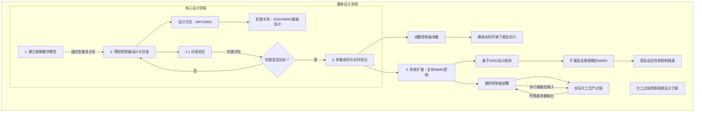

```mermaid
flowchart TD

subgraph 整体设计流程

A[化工过程控制系统设计方案]

subgraph 核心设计流程

B[1. 建立精确数学模型] -->|描述变量及关系| C[2. 预测控制器设计与仿真]

C --> D[设计方法：MPC/DMC]

D --> E[处理关系：SISO/MIMO基础设计]

C --> F[2.1 仿真验证]

F -->|性能评估| G{性能是否达标？}

G -->|是| H[3. 参数调优与实时验证]

G -->|否| C

end

H --> I[调整控制器参数]

I --> J[确保实时环境下稳定运行]

H --> K[4. 系统扩展：复杂MIMO控制]

K --> L[基于DIDO设计经验]

L --> M[扩展至高维强耦合MIMO]

M --> N[提高适应性和控制精度]

K --> O[最终控制器部署]

O --> P[实际化工生产过程]

P -->|传感器测量输出| O

O -->|执行器施加输入| P

end
```