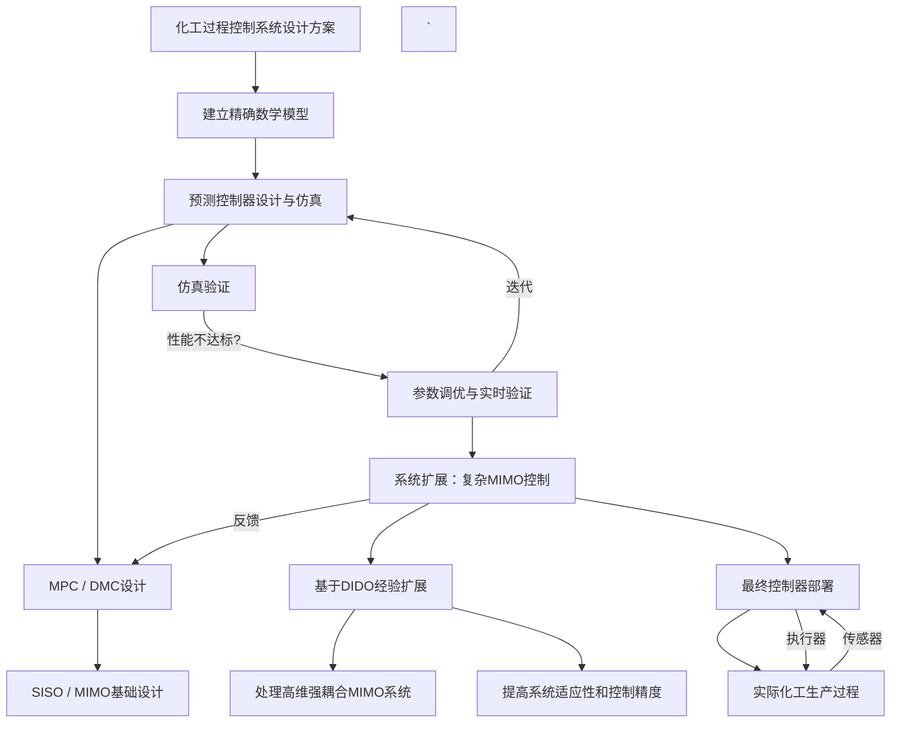

```mermaid
```mermaid

graph TD

A[化工过程控制系统设计方案] --> B[建立精确数学模型]

B --> C[预测控制器设计与仿真]

C --> D[MPC / DMC设计]

D --> E[SISO / MIMO基础设计]

C --> F[仿真验证]

F -->|性能不达标?| G[参数调优与实时验证]

G -->|迭代| C

G --> H[系统扩展：复杂MIMO控制]

H --> I[基于DIDO经验扩展]

I --> J[处理高维强耦合MIMO系统]

I --> K[提高系统适应性和控制精度]

H --> L[最终控制器部署]

L --> M[实际化工生产过程]

M -->|传感器| L

L -->|执行器| M

H -->|反馈| D

`

```